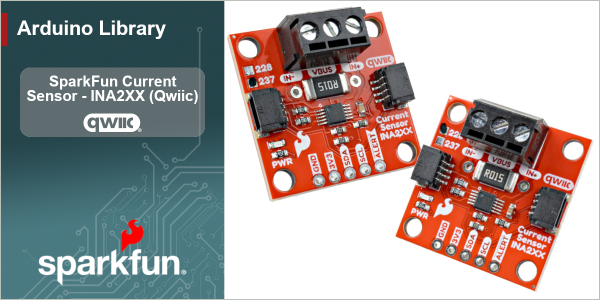

# SparkFun INA2XX Arduino Library

Arduino Library for the SparkFun Qwiic Power Monitor (INA228 / INA237)


[](https://github.com/sparkfun/SparkFun_INA2XX_Arduino_Library/actions/workflows/test-compile-sketch.yml)


The SparkFun Qwiic Power Monitor puts a Texas Instruments INA2XX-series digital power monitor on a Qwiic-enabled breakout, making high-side current, voltage, and power measurement as simple as plugging in a cable. The board carries a 15 mΩ shunt resistor and a screw terminal for the load and bus connections, so you can measure a supply rail without breaking out a meter.

This library provides an easy-to-use interface to both the **INA228** (20-bit, high-precision, with energy and charge accumulation) and the **INA237** (16-bit) over I2C, built on the [SparkFun Toolkit](https://github.com/sparkfun/SparkFun_Toolkit). Both parts share the same register interface and the same library API — pick the class that matches your board and the rest of your sketch is identical. The library handles device setup and calibration for you and returns real-world readings in amps, volts, and watts, while still exposing the lower-level registers for advanced use.

## Supported Devices

| Device | ADC | Precision | Energy / Charge | Notes |
| -- | -- | -- | -- | -- |
| INA228 | 20-bit | High (312.5 nV shunt LSB) | ✅ 40-bit ENERGY + CHARGE accumulators | Use `SfeINA228ArdI2C` |
| INA237 | 16-bit | Standard (5 µV shunt LSB) | ❌ | Use `SfeINA237ArdI2C` |

## Functionality

The library exposes the full shared feature set of the INA228 and INA237:

- Current, bus voltage, shunt voltage, power, and die-temperature readings in engineering units
- One-call `calibrate()` for any shunt resistor and expected current range
- Selectable ADC range (±163.84 mV / ±40.96 mV) for a precision-vs-range trade-off
- Configurable ADC operating mode, conversion times, and sample averaging
- Energy (Joules) and charge (Coulombs) accumulation on the INA228
- A full alert/diagnostic system: over/under-voltage, over-current (via shunt), over-temperature, over-power, conversion-ready, and math-overflow flags
- Programmable alert thresholds (with millivolt convenience setters) and alert pin polarity/latch configuration
- Raw register accessors for every measurement when you need the unscaled value

> [!NOTE]
> The INA228 and INA237 share an I2C register map but differ in register width and LSB scaling. The library captures those differences internally (the base driver is a template parameterized on the raw register types), so the same method calls work on both parts.

## Hardware Connections

The board connects over I2C using the Qwiic connector — no soldering required. The INA2XX parts use a default 7-bit I2C address of `0x40`, jumper-selectable across `0x40`–`0x4F`.

| Pin / Header | Use | Notes |
| -- | -- | -- |
| Qwiic / I2C | Power + communication | Standard 3.3V Qwiic connection |
| VIN+ / VIN- | Current-sense path | Load current flows through the on-board 15 mΩ shunt between these terminals |
| VBUS | Bus voltage sense | Connect to the rail whose voltage you want to measure |
| ALERT | Alert / interrupt output | Optional — asserts on the alert conditions you enable |

## Using the Library

### Installation

Install through the Arduino Library Manager by searching for **SparkFun INA2XX**, or download this repository as a ZIP and add it via *Sketch > Include Library > Add .ZIP Library*. This library depends on the [SparkFun Toolkit](https://github.com/sparkfun/SparkFun_Toolkit), which the Library Manager will offer to install alongside it.

### Getting Started

The I2C interface is provided by the `SfeINA228ArdI2C` and `SfeINA237ArdI2C` classes. Declare the object that matches your device:

```c++
#include <SparkFun_INA2XX.h>

// Uncomment the device you're using
SfeINA228ArdI2C myINA;
// SfeINA237ArdI2C myINA;
```

In `setup()`, start I2C and call `begin()`. `begin()` initializes the bus and confirms the device is present by checking its Device ID:

```c++
Wire.begin();

if (myINA.begin() == false)
{
    Serial.println("Power monitor not found, check your wiring!");
    while (1)
        delay(1000);
}
```

### Calibration

Before reading current or power, calibrate the device for your shunt resistor and expected maximum current. The SparkFun board uses a 15 mΩ shunt; this example sets a 10 A maximum:

```c++
// calibrate(shuntResistanceOhms, maxCurrentAmps)
myINA.calibrate(0.015, 10.0);
```

`calibrate()` computes `CURRENT_LSB` and writes the hardware `SHUNT_CAL` register, after which all current, power, energy, and charge reads are automatically scaled. See [Example 05](examples/Example05_CustomShuntResistor/Example05_CustomShuntResistor.ino) for using a custom shunt resistor and the reduced ADC range.

> [!IMPORTANT]
> If you change the ADC range with `setADCRange()`, call it **before** `calibrate()` — the calibration math depends on the selected range.

### Reading Measurements

Each measurement is returned through a reference argument:

```c++
float busVoltage = 0.0f, current = 0.0f, power = 0.0f, temperature = 0.0f;

myINA.getBusVoltage_V(busVoltage);   // Volts
myINA.getCurrent_A(current);         // Amps
myINA.getPower_W(power);             // Watts
myINA.getDieTemp_C(temperature);     // degrees C
myINA.getShuntVoltage_mV(busVoltage); // shunt drop in mV
```

If you only need the raw register value, `getCurrentRaw()`, `getBusVoltageRaw()`, `getShuntVoltageRaw()`, and `getPowerRaw()` return the unscaled readings.

### A Note on Return Values and Error Handling

Most library methods return a SparkFun Toolkit error code (`ksfTkErrOk` on success, a negative value on failure) and pass the reading back through a reference parameter. This lets you tell a real reading of zero apart from a communication failure. For simple sketches you can ignore the return value:

```c++
float amps;
myINA.getCurrent_A(amps); // assume good data
```

For robust applications, check it:

```c++
float amps;
if (myINA.getCurrent_A(amps) != ksfTkErrOk)
{
    // Handle the communication error
}
else
{
    // amps holds a valid reading
}
```

### Energy and Charge (INA228)

The INA228 adds 40-bit accumulators for energy and charge, read as doubles in Joules and Coulombs:

```c++
double joules = 0.0, coulombs = 0.0;
myINA.getEnergy_J(joules);
myINA.getCharge_C(coulombs);

myINA.resetAccumulators(); // clear the ENERGY and CHARGE registers
```

These methods exist only on `SfeINA228ArdI2C`.

### Alerts and Diagnostics

The DIAG_ALRT register exposes the device's status flags and alert configuration. Thresholds can be set in raw counts or, for the common cases, directly in millivolts:

```c++
myINA.setBusOverVoltageThreshold_mV(14000.0f); // alert above 14 V
myINA.setAlertLatch(true);                      // latch the alert until read

bool overVoltage = false;
myINA.isBusOverVoltage(overVoltage);
```

See [Example 02](examples/Example02_AlertConfiguration/Example02_AlertConfiguration.ino) and [Example 06](examples/Example06_Diagnostics/Example06_Diagnostics.ino) for the full alert and diagnostic workflow.

## Examples

The library ships with a set of examples that build from the basics to more advanced features:

- [Example 01 - Basic Readings](examples/Example01_BasicReadings/Example01_BasicReadings.ino) — current, voltage, power, and temperature
- [Example 02 - Alert Configuration](examples/Example02_AlertConfiguration/Example02_AlertConfiguration.ino) — thresholds, alert pin, and status flags
- [Example 03 - Power and Energy](examples/Example03_PowerAndEnergy/Example03_PowerAndEnergy.ino) — power plus INA228 energy/charge accumulation
- [Example 04 - Advanced Config](examples/Example04_AdvancedConfig/Example04_AdvancedConfig.ino) — ADC mode, conversion times, and averaging
- [Example 05 - Custom Shunt Resistor](examples/Example05_CustomShuntResistor/Example05_CustomShuntResistor.ino) — calibrating for your own shunt and ADC range
- [Example 06 - Diagnostics](examples/Example06_Diagnostics/Example06_Diagnostics.ino) — reading and interpreting the diagnostic flags

## Documentation

API documentation is generated with Doxygen and published to GitHub Pages from the `main` branch.

## Products That Use This Library

- SparkFun Qwiic Power Monitor (INA228 / INA237)

## Contributing

If you would like to contribute to this library, please report issues and submit pull requests against the GitHub repository.

## License Information

This product is ***open source***!

This product is licensed using the [MIT Open Source License](https://opensource.org/license/mit)

Please see [LICENSE.md](LICENSE.md) for more information.

- Your friends at SparkFun
